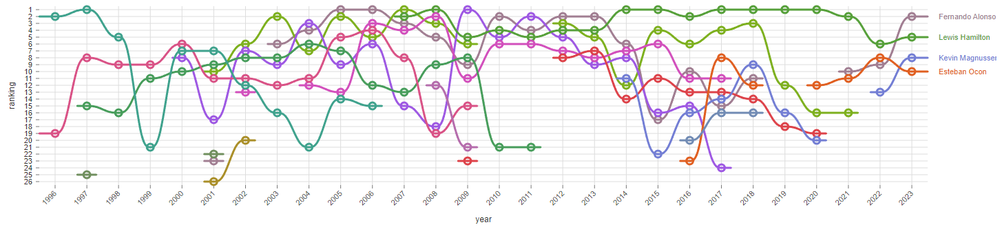
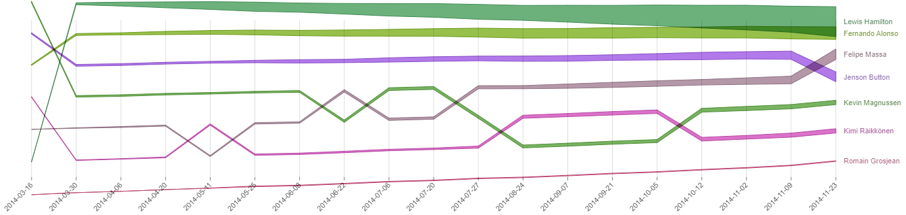

 (max 8 pages) 

 o Describe the path you took to obtain the final result 

 o Explain challenges that you faced and design decisions that you took 

 o Reuse the sketches/plans that you made for the first milestone, expanding them and explaining the changes 

 o Care about the visual/design of this report 
 
 o Peer assessment: include a breakdown of the parts of the project completed by each team member.

# Process Book
By group Data Rizzards: Borbely Ambroise, Michalski Elisa & Dixit Sabharwal

### Path taken to obtain the final result 

#### Choosing a dataset
At the beginning of the project, the most important aspect is choosing what we want to show and which dataset to use.
During a first brainstorming session, we explored various datasets and discussed the most exciting and effective options.
We finally agreed on a dataset on Formula-1 due to its completeness the multitude of possibilities it offers for analysis and visualization.

We decided on creating an interactive visualization tool facilitating the navigation of users, both newcomers and experts, through the world of Formula-1.
We wanted to focus on three aspects:
- Driver Performance: Showcase the evolution of a driver's performance over time;
- Race Analysis: For a specific race, illustrate how the race unfolded;
- Transport overview: Yearly Overview: Display race locations on a world map and travels from one to another.

To show races, we also found a repository containing SVG files for some of the Formula 1 tracks. 

#### Choosing the visualizations
To decide how exactly we wanted to show our main aspects, we brainstormed again and agreed that a website with a page for each separate visualization would be best. 
This also allowed us to separate work more easily.

Our website is hence composed of 4 sections; one being the home page and the three others will contain specific visualizations of the Formula-1 data:

- Driver:

The page on driver's performance will showcase the evolution of a given driver's performance over time.
The objective is to allow users to observe how drivers' rankings have changed over the years and compare their performance against other drivers.
Users will be able to view the driver's ranking across different years and their cumulative points.

After selecting a set of drivers of interest, the users will be able to see two visualizations.
The first shows the rank of the selected drivers during the years. The user will see how the performances of their selected drivers change over the years.

The second shows, for a selected year, the cumulated points over the season. The user will see how their selected drivers' position in the competition over the season.

- Race
This page will focus on an animated visualization of the race. The user will be able to select a track and a driver and see their performance over different seasons/years.
Motivation:
The user can compare the performance of their favorite driver on the same track over different seasons.
F1 does a complete re-design of the cars every 6-7 years. We can visualize how the performance of a driver changed after the redesign.
If a driver changed teams, we can compare their performance while driving cars from different teams

- Transport
For this visualisation, the main idea is to show the different locations of the circuits during the year. This will be shown via an animation on a map showing the position/country of each circuit with a travel animation between the countries in the order that the season is going.

It will then be possible to see also the number of kilometres travelled during the season. This number is dynamically increased as the travel animations are going.

To make it work for every season the user will choose the season wanted.

#### Creating the website

##### Season sketch (Ambroise)

###### Basic sketch in the website
For this sketch, as we had the idea of what we wanted to, we first found an example of the road-map from an example linked on the d3.js library main page. Once this was done we also had to redo the path drawing between countries that was not included in the github example.

###### Data processing
As I was more experienced with MySQL and python than other tools I chose to use this to format my data.
The first thing I did was to import in mySQL 3 files the : the races, the circuits, and also the json file world-country-names.json that contained an id/name relation that is working with the TopoJSON data that is used in the sketch. To import the data it was quite easy as there is an import wizard in MySQL workbench
Once everything imported in MySQL to things needs to be done :
1) Join all the data together
2) Correct manually the data that are not linked correctly
3) Export the data as a json file
4) Modify the format of the new json
5) Import the data in the project

**1**
For the first point, I used a mySQL, which gave me the list of the circuit sorted with all the data needed : This data also contains the id in the world-country-names.json which will be helpful after it to make the connection with the map on the website. 

**2**
After this I noticed as I’m linking the world-country-names.json on the name that some lines have the “id” field to null. After some research it seems that it was because the display name that is in world-country-names.json is not the same as the country name in the F1 data. So I changed the names of the countries in the world-country-names.json to make it match with the names of the F1 data. And re-import the modified world-country-names.json into MySQL.
ow that everything is fixed we can export the data. 

**3**
This is trivial as MySQL has a feature for that.

**4**
Now to make the access easier during the project I chose to modify the format of the new json exported from MySQL (that is just a list of dict).
The format I chose was to group the races by the year.
To do it I used Python with the built-in json modules.

**5**
I needed to create an interface and type the data in typescript and then I imported them and the project.

###### Using the data in the project and selection menu
With the modified example sketch, the world tour was just going through all the countries. So I modified it the following way in order that it only goes through the countries that have the id contained in the processed json file explained above.
Then I created a field to fill with the season year (which is a Autocomplete component from material UI) and linked it to a react state (used in the map/GlobePlot component) to make everything interact together.

###### Countries that doesn’t exist in the map
During the test phase of the project I discovered that the small countries (like Monaco) were not being drawn and so that it is not possible to travel to them.
To avoid this problem I did 2 things :
I changed the json file with all the races in order that the idea of those small countries point to the nearest country that is drawn on the map
I added an attribute that if this country cannot be shown in the map (because it is too small) we do not draw it in red (otherwise with (1) we would draw France in red when we traveled to Monaco).

###### Counter
For the counter I used a library called countup.js and used the help of chatGTP to convert it as a React component.
Then I created a state in the GlobePlot (which contains the map) file that will be filled with the total number of kilometers.
To calculate the number of kilometers between 2 points I found a great example online that worked great (I still did some tests on google maps that showed that the distances were the same).

###### Issues with the start / pause button
Compared to the base sketch I did not manage to find a way to integrate this pause in the project. As the animation is quite complicated we use a “tween” function. This function takes values between 0 and 1 and draws the sketch at the correct state of the animation.
I tried to make some changes on this function to make a pause phase and managed to pause the animation but there was some strange behavior when the animation was resumed. This is because when you pause the animation it does not really do it in the background (only freezes the animation) and this causes problems when un-pausing the world tour.
Layout
At the end I just changed the layout in order that some things are centered and some others not. For that I used some CSS.

### Challenges
TODO

### Peer assessment

Each member worked on a page (from data processing to final product).

Elisa Michalski worked on the Driver's page.
Dixit Sabharwal worked on the Race's page.
Ambroise Borbely worked on the Transport's page.

Each member brainstormed together and reviewed each other pages.

