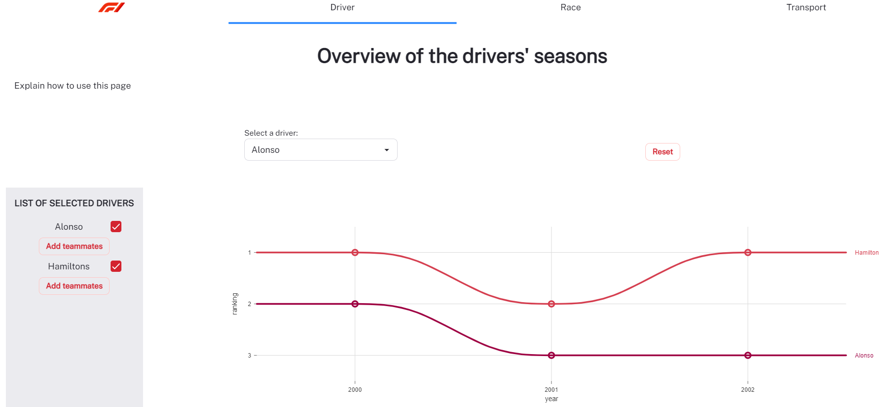
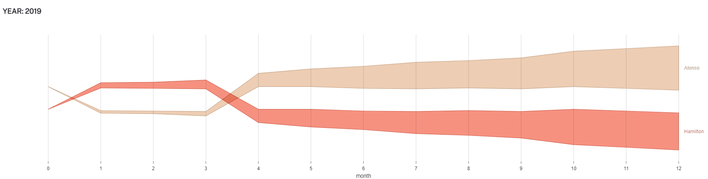
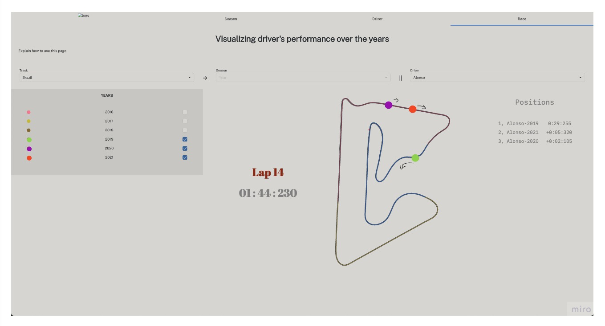

## Milestone 2

### Link to the [functional website](https://com-480-data-visualization.github.io/project-2023-data-rizzards)

Our website is composed of 4 sections; one being the home page and the three others will contain specific visualizations of the Formula-1 data.

### 1. Driver

This page will show, for a given driver or a few selected ones, how the drivers' performance evolved over time. The user will see their ranking over different years as well as their cumulative points.

##### Motivation:
- The user will be able to see the evolution of their ranking during the years and compare it with other drivers.
- From the cumulative points of a driver, we can visualize how they performed against others during a season.

##### For context see this sketch:

###### Driver selection
After selecting one or multiple drivers, they will appear on the list of selected drivers. Additionnaly, the user will also be able to click on 'Add Teammates' to automatically add all the drivers who have been teammates with to the selected list. There is two ways to deselect drivers; either by unchecking them, or clicking on the reset button.

###### Driver visualization

The rankings of the drivers will be shown over the years. Furthermore, by selecting a year, the user will see the cumulative points of each driver over the season - see below.

##### Additional features:
- The user can compare the relative performance of a single driver over different seasons.

##### Tools used:
- For the plots, we use the library [nivo](https://nivo.rocks/about/); and more specifically the tools [AreaBump](https://nivo.rocks/area-bump/) and [Bump](https://nivo.rocks/bump/).

### 2. Race

This page will focus on an animated visualization of the race. The user will be able to select a track and a driver and see their performance over different seasons/years.

##### Motivation:

- The user can compare the performance of their favorite driver on the same track over different seasons.
- F1 does a complete re-design of the cars every 6-7 years. We can visualize how the performance of a driver changed after the redesign.
- If a driver changed teams, we can compare their performance while driving cars from different teams.

##### For context see this sketch:

After selecting the track and driver, we will retrieve all seasons where the driver raced on the selected track. (The user will be able to select the seasons of interest.)

The main focus is the track. The track will be animated and the user will be able to see the position of the drivers at each time step.

- The dots on the track will represent the relative position of the driver at each time step.
- The color of the dot will represent the season.
- The position of each dot will change at a speed proportional to the lap time.

##### Additional features:

- We can allow the user to instead select a track and season (eg: Monaco 2021), and see a visualization of how the race unfolded. The user can see the relative position of the drivers at each lap.

- We can allow the user to select a track and a team, and see the relative performance of the two drivers in the same team.

##### Tools used:

- To draw the track, we will use SVGs from this [repository](https://github.com/f1laps/f1-track-vectors).
- To animate the dots over the track, we will directly manipulate the svg using [svg-path-properties](https://github.com/rveciana/svg-path-properties).

### 3. Transport

This section will show, for each year, a list of teams that participated, the schedule of the races and a flow map showing the movement of the teams during the year.
Furthermore, we add a count of total kilometers traveled as well as an approximation of CO2 emission.
-> lecture 8 is about maps

• Include sketches of the vizualiation you want to make in your final product.
• List the tools that you will use for each visualization and which (past or future) lectures you will need.
• Break down your goal into independent pieces to implement. Try to design a core visualization (minimal viable product) that will be required at the end.
Then list extra ideas (more creative or challenging) that will enhance the visualization but could be dropped without endangering the meaning of the
project.
